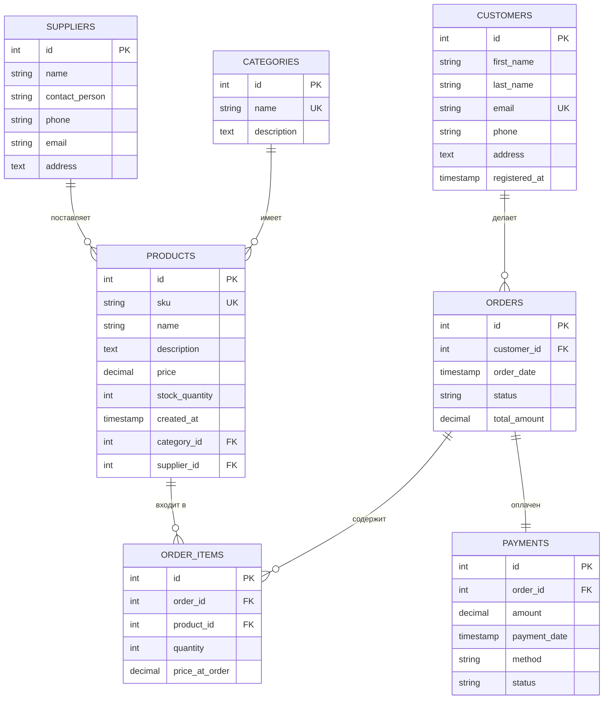

# Online Store Database + Integration Layer

## Описание проекта

Данный проект представляет собой **полноценное интеграционное решение** для интернет-магазина. Он включает:
- Реляционную базу данных (PostgreSQL) с расширенной схемой (категории, поставщики, платежи).
- Триггеры для автоматического пересчёта сумм заказов и обновления остатков.
- Индексы для ускорения запросов.
- Представления (VIEWS) для аналитических отчётов.
- Python-скрипт для выполнения аналитики и сохранения отчётов в CSV.
- REST API на Flask для получения отчётов и создания заказов.

Проект разработан на **Ubuntu 22.04** с использованием **PostgreSQL 14+** и **Python 3**.  
Цель — показать навыки проектирования БД, написания SQL, автоматизации через триггеры и интеграции с внешним интерфейсом.

---

## Технологии

- **СУБД:** PostgreSQL 14+
- **ОС:** Ubuntu 22.04 LTS
- **Язык:** SQL, Python 3
- **Библиотеки Python:** psycopg2-binary, Flask
- **Виртуальное окружение:** venv

---

## Схема базы данных (ER-диаграмма)

Расширенная структура базы данных
Новые таблицы
categories – категории товаров (id, name, description).

suppliers – поставщики (id, name, contact_person, phone, email, address).

payments – платежи (id, order_id FK, amount, payment_date, method, status).

Изменения в существующих таблицах
products – добавлены внешние ключи category_id и supplier_id.

Триггеры
update_order_total – автоматически пересчитывает orders.total_amount при любом изменении order_items.

update_stock – автоматически уменьшает products.stock_quantity при добавлении позиции в заказ.

Индексы
Созданы индексы на все внешние ключи и часто используемые поля для ускорения JOIN-запросов.

Представления (VIEWS)
v_customer_spending – общая сумма покупок по каждому клиенту.

v_product_performance – продажи по товарам с категориями и поставщиками.

v_monthly_revenue – помесячная выручка по доставленным заказам.

Установка и развертывание
1. Клонирование репозитория
bash
git clone https://github.com/kloov-oops/online-store-db.git
cd online-store-db
2. Установка PostgreSQL (если не установлен)
bash
sudo apt update
sudo apt install postgresql postgresql-contrib -y
3. Создание базы данных и пользователя
bash
sudo -u postgres psql
CREATE DATABASE online_store;
CREATE USER store_admin WITH PASSWORD 'your_password';
GRANT ALL PRIVILEGES ON DATABASE online_store TO store_admin;
\q
4. Создание таблиц, триггеров, индексов и представлений
В репозитории есть файл create_tables.sql (обновлённый). Выполните:

bash
sudo -u postgres psql -d online_store < create_tables.sql
5. Заполнение тестовыми данными
bash
sudo -u postgres psql -d online_store < insert_data.sql
6. Настройка Python-окружения
Установите python3-venv, если ещё нет:

bash
sudo apt install python3-venv -y
Создайте и активируйте виртуальное окружение:

bash
python3 -m venv venv
source venv/bin/activate
Установите зависимости:

bash
pip install psycopg2-binary flask
7. Настройка подключения к БД
В файлах analytics.py и app.py замените пароль your_password на реальный пароль пользователя store_admin.

Использование
Аналитический скрипт (analytics.py)
Запускает три отчёта и сохраняет их в CSV:

bash
python3 analytics.py
Результаты:

top_products.csv – топ-3 товара по продажам.

customer_spending.csv – траты по клиентам.

monthly_revenue.csv – помесячная выручка.

REST API (app.py)
Запускает сервер на http://localhost:5000:

bash
python3 app.py
Доступные эндпоинты
GET /top-products – возвращает JSON с топ-3 товарами.

Пример:

bash
curl http://localhost:5000/top-products
GET /customer-spending – возвращает траты по клиентам.

GET /monthly-revenue – возвращает помесячную выручку.

POST /add-order – создаёт новый заказ.

Тело запроса (JSON):

json
{
  "customer_id": 1,
  "items": [
    {"product_id": 1, "quantity": 2},
    {"product_id": 3, "quantity": 1}
  ]
}
Пример:

bash
curl -X POST http://localhost:5000/add-order \
  -H "Content-Type: application/json" \
  -d '{"customer_id": 1, "items": [{"product_id": 1, "quantity": 2}]}'
Ответ вернёт order_id и статус.

Аналитические запросы (примеры)
Все запросы собраны в файле queries.sql. Ниже – несколько ключевых.

Топ категорий по выручке
sql
SELECT c.name, SUM(oi.quantity * oi.price_at_order) AS revenue
FROM order_items oi
JOIN products p ON oi.product_id = p.id
JOIN categories c ON p.category_id = c.id
GROUP BY c.name
ORDER BY revenue DESC;
Клиенты без покупок
sql
SELECT c.*
FROM customers c
LEFT JOIN orders o ON c.id = o.customer_id
WHERE o.id IS NULL;
Список заказов с платежами
sql
SELECT o.id, o.order_date, o.total_amount, p.method, p.status
FROM orders o
JOIN payments p ON o.id = p.order_id;
Структура репозитория
text
online_store_db/
├── README.md                # Документация проекта
├── create_tables.sql        # Создание таблиц, триггеров, индексов, представлений
├── insert_data.sql          # Тестовые данные (с новыми таблицами)
├── queries.sql              # Аналитические запросы
├── online_store_dump.sql    # Полный дамп БД
├── analytics.py             # Python-скрипт для аналитики (CSV)
├── app.py                   # REST API на Flask
├── top_products.csv         # Пример отчёта (генерируется)
├── customer_spending.csv    # Пример отчёта (генерируется)
├── monthly_revenue.csv      # Пример отчёта (генерируется)
└── venv/                    # Виртуальное окружение Python (не включается в Git)
Выводы
В ходе проекта были продемонстрированы навыки:

Проектирования реляционной БД (ER-диаграмма, нормализация до 3НФ).

Написания DDL, DML, триггеров, индексов и представлений.

Работы с PostgreSQL в командной строке Ubuntu.

Интеграции БД с Python через psycopg2.

Создания REST API на Flask для выполнения операций и получения отчётов.

Оформления технической документации.

Проект является готовым интеграционным решением, которое может служить основой для более сложных систем, например, интеграции 1С с маркетплейсами.

Контакты
Автор: jiv
GitHub: https://github.com/kloov-oops
Репозиторий: https://github.com/kloov-oops/online-store-db
